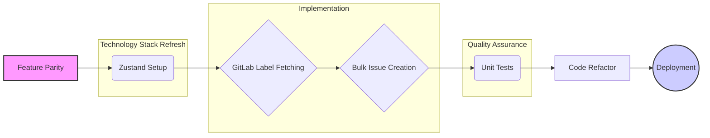

# Modernization Plan for figjam-planning-to-gitlab

## Goal

Modernize the figjam-planning-to-gitlab tool by migrating from Next.js Pages Router to the App Router and refreshing the tech stack, while ensuring all original functionalities are preserved.

## Plan

1.  **Feature Parity:** Ensure all features from the original tool are implemented in the new App Router structure. This includes:
    - Fetching sticky notes from FigJam files.
    - Selecting sticky notes.
    - Fetching GitLab labels.
    - Creating GitLab issues from selected notes.
    - Handling errors and displaying appropriate messages to the user.
2.  **Technology Stack Refresh:** Implement the desired technology stack changes:
    - Use React/TypeScript for the UI.
    - Use Zustand for state management.
    - Use Jest for testing.
    - Ensure the UI components are based on `shadcn/ui`.
3.  **Code Structure and Organization:** Refactor the codebase to improve its structure and organization. This may involve:
    - Moving logic out of the `page.tsx` file into separate components and utility functions.
    - Creating a more modular and reusable component structure.
    - Adding unit tests for the core functionality.
4.  **Testing:** Implement comprehensive unit and integration tests to ensure the application is working correctly and to prevent regressions.
5.  **Deployment:** Deploy the modernized application to a suitable hosting platform (e.g., Vercel, Netlify).

## Detailed Steps

1.  **Set up Zustand for state management:**
    - Install Jotai: `npm install jotai`
    - Create stores for managing the application state (e.g., `figmaStore`, `gitlabStore`).
    - Migrate the existing `useState` hooks to Zustand stores.
2.  **Implement GitLab label fetching:**
    - Create an API endpoint `/api/gitlab/labels` to fetch GitLab labels.
    - Implement the `fetchGitlabLabels` function to call the API endpoint and update the `gitlabStore`.
    - Display the GitLab labels in the UI and allow the user to select them.
3.  **Implement bulk issue creation:**
    - Create an API endpoint `/api/gitlab/issues` to create GitLab issues.
    - Implement the `handleCreateIssues` function to call the API endpoint and create the issues.
    - Display a success message or error message to the user after the issues are created.
4.  **Add unit tests:**
    - Install Jest and testing libraries: `npm install --save-dev jest @testing-library/react @testing-library/jest-dom`
    - Write unit tests for the core functionality, such as:
      - Extracting the file key from a Figma URL.
      - Fetching sticky notes from the Figma API.
      - Creating GitLab issues from sticky notes.
5.  **Refactor the codebase:**
    - Move logic out of the `page.tsx` file into separate components and utility functions.
    - Create a more modular and reusable component structure.
6.  **Deployment:**
    - Deploy the application to a suitable hosting platform (e.g., Vercel, Netlify).

## Mermaid Diagram

